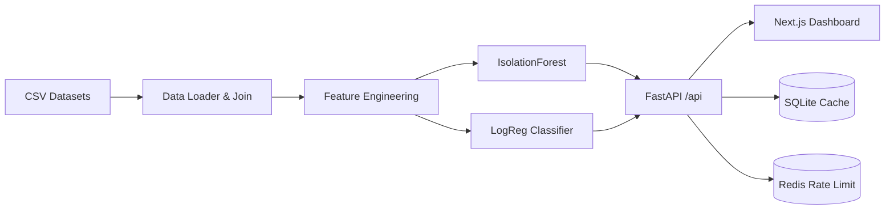

# Lab Lecture 10: Fraud Analytics Full‑Stack (FastAPI + Next.js) — Audit‑Ready

> เป้าหมาย: สร้างระบบ “ตรวจจับธุรกรรมเสี่ยง” แบบครบวงจร ตั้งแต่ **Data → Model → API → Dashboard**  
> ชุดข้อมูลอ้างอิง: ไฟล์ที่แนบมา (Transaction / Customer / Merchant / Fraud Indicators)

---

## 1) Learning Outcomes (ผลลัพธ์การเรียนรู้)

เมื่อจบแล็บ นักศึกษาจะสามารถ:

1. อธิบาย **data lineage** และโครงสร้างข้อมูลธุรกรรม (transaction metadata + customer + merchant)
2. สร้าง **feature set** สำหรับตรวจจับความเสี่ยง (amount / anomaly score / behavior)
3. ฝึกโมเดล 2 แบบ
   - **Unsupervised**: Isolation Forest (หา outlier/novelty)
   - **Supervised**: Logistic Regression (จาก fraud indicator → label)
4. เปิดบริการ **REST API** ด้วย FastAPI พร้อม validation และ error handling
5. ทำหน้า Dashboard ด้วย Next.js เพื่อดู Top‑Risk, Score, Explain
6. ออกแบบ “Auditability” ขั้นต้น: logging, reproducibility, versioning, and controls

---

## 2) Architecture Overview



> หมายเหตุ: ใน test environment อาจปิด Redis ได้ (ดู env `DISABLE_RATE_LIMIT=1`)

---

## 3) Repository Layout (โครงสร้างโฟลเดอร์)

- `data/` ชุดข้อมูลจากเอกสารที่แนบมา (จัดหมวดหมู่ตามโฟลเดอร์เดิม)
- `backend/` FastAPI + โมเดล + unit tests
- `frontend/` Next.js dashboard
- `docs/` คู่มือแล็บ (ไฟล์นี้)
- `notebooks/` Jupyter Notebook สำหรับ EDA/ทดลองโมเดล

---

## 4) Quick Start (Run ด้วย Docker)

### 4.1 เริ่มระบบ
```bash
docker compose up --build
```

บริการ:
- Frontend: http://localhost:3000
- Backend API: http://localhost:8000/docs

### 4.2 ทดสอบสุขภาพระบบ
```bash
curl http://localhost:8000/healthz
```

---

## 5) Core API Endpoints

### Dataset
- `GET /dataset/summary` — สรุปจำนวนแถว/คอลัมน์และช่วงเวลา
- `GET /dataset/sample?n=20` — ตัวอย่างธุรกรรม

### Fraud Analytics
- `POST /fraud/train` — ฝึกโมเดลและบันทึกไว้ใน `backend/models/`
- `GET /fraud/top?limit=50` — รายการธุรกรรมที่เสี่ยงสูงสุด
- `POST /fraud/score` — ให้คะแนนความเสี่ยงของ TransactionID
- `POST /fraud/explain` — อธิบายปัจจัยเสี่ยง (top factors) จาก feature contribution แบบง่าย

---

## 6) Lab Tasks (งานแล็บ)

### Task A — Data Profiling & Join (20 คะแนน)
1. เปิด `notebooks/Lab10_Student.ipynb`
2. โหลดไฟล์หลัก 3 กลุ่ม
   - transaction_records + transaction_metadata
   - customer_data + account_activity
   - merchant_data
3. ตรวจสอบ missing / duplicated keys
4. สร้างตาราง join และสรุป
   - #transactions, #customers, #merchants
   - distribution ของ Amount และ AnomalyScore

**Deliverable:** ตารางสรุป + ภาพ histogram 2 รูป

---

### Task B — Feature Engineering (25 คะแนน)
สร้าง feature อย่างน้อย 8 ตัวอย่างต่อไปนี้ (หรือมากกว่า)
- Amount
- AnomalyScore
- Age, AccountBalance
- Hour (จาก Timestamp)
- DaysSinceLastLogin
- TxCount_1h (จำนวนธุรกรรมใน 1 ชั่วโมงล่าสุด)
- AmountToCustomerAvg (Amount เทียบค่าเฉลี่ยลูกค้า)

**Deliverable:** data dictionary ของ feature + rationale (เหตุผลเชิงตรวจสอบ)

---

### Task C — Train Models + Baseline Metrics (25 คะแนน)
1. เรียก `POST /fraud/train`
2. ใน notebook คำนวณ baseline metrics ของ classifier (precision/recall/F1)
3. เปรียบเทียบ Top‑K risk จาก iforest กับ label จริง (ถ้ามี)

**Deliverable:** ตาราง metrics + ข้อสรุป 5–8 บรรทัด

---

### Task D — API Verification (15 คะแนน)
1. เลือก TransactionID 3 รายการจาก `GET /fraud/top`
2. เรียก `POST /fraud/score` และ `POST /fraud/explain`
3. ตรวจสอบ consistency:
   - score สูง → อยู่ใน top list
   - factors สอดคล้องกับ feature ที่ผิดปกติ

**Deliverable:** screenshot ผล API (หรือ JSON) 3 เคส

---

### Task E — Dashboard & Audit Notes (15 คะแนน)
1. เปิดหน้าเว็บ http://localhost:3000
2. ตรวจสอบหน้า:
   - Summary
   - Train Models
   - Top Risk list
   - Score & Explain panel
3. เขียน “Audit Notes” สั้น ๆ:
   - data lineage
   - model versioning (ไฟล์ joblib)
   - control ที่ควรมีเพิ่ม (เช่น access control, immutable logs)

**Deliverable:** 1 หน้ากระดาษ (Markdown/PDF)

---

## 7) Unit Tests

รัน unit tests ของ backend:
```bash
cd backend
pytest -q
```

---

## 8) Extensions (Optional / Bonus)

- เพิ่ม model: XGBoost หรือ LightGBM (ถ้าสภาพแวดล้อมรองรับ)
- เพิ่ม endpoint `POST /fraud/score_batch`
- เพิ่ม log schema แบบ audit: request_id, user_id, model_version, data_version, timestamp

---

## 9) Submission Checklist

- ✅ Notebook (Task A–C)
- ✅ Evidence (JSON/screenshot) (Task D)
- ✅ Audit Notes (Task E)
- ✅ โค้ดแก้ไข (ถ้ามี) push เป็น repo หรือ zip

